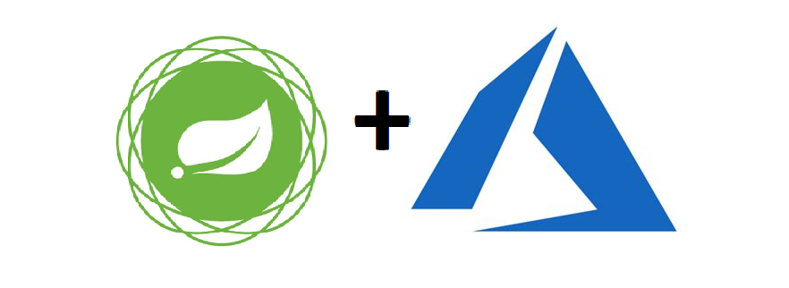

<h1 align="center">Calculadora</h1>

<p align="center">
  

  
  </p>



## 🌱 Projeto Calculadora simnples

Para os testes envolvendo o uso de `pipelines ci/cd` e `Kubernetes` a partir do `Microsoft Azure`, será criada uma calculadora simples exposta como Rest API, feita em Java 11 usando Spring Boot.

## 🛠️ Requisitos

- Java 11 JDK. link: https://www.oracle.com/technetwork/java/javase/downloads/jdk11-downloads-5066655.html 

- Apache-maven-3.6.1. link: https://maven.apache.org/download.cgi

## 🚀 Executar
 
- Para executar a calculadora digite na raiz do projeto o comando abaixo:

- Windows: 
```
*./mvnw spring-boot:run*
```
- linux: 
```
*mvn spring-boot:run*
 ```

## ✨ Testando a calculadora 

- soma 
*http://localhost:8080/calculadora/soma/?numero=1&numero2=4*

- subtracao 
*http://localhost:8080/calculadora/subtracao/?numero=1&numero2=4*

- multiplicacao 
*http://localhost:8080/calculadora/multiplicacao/?numero=1&numero2=4*

- divisao 
*http://localhost:8080/calculadora/divisao/?numero=8&divisor=2*


